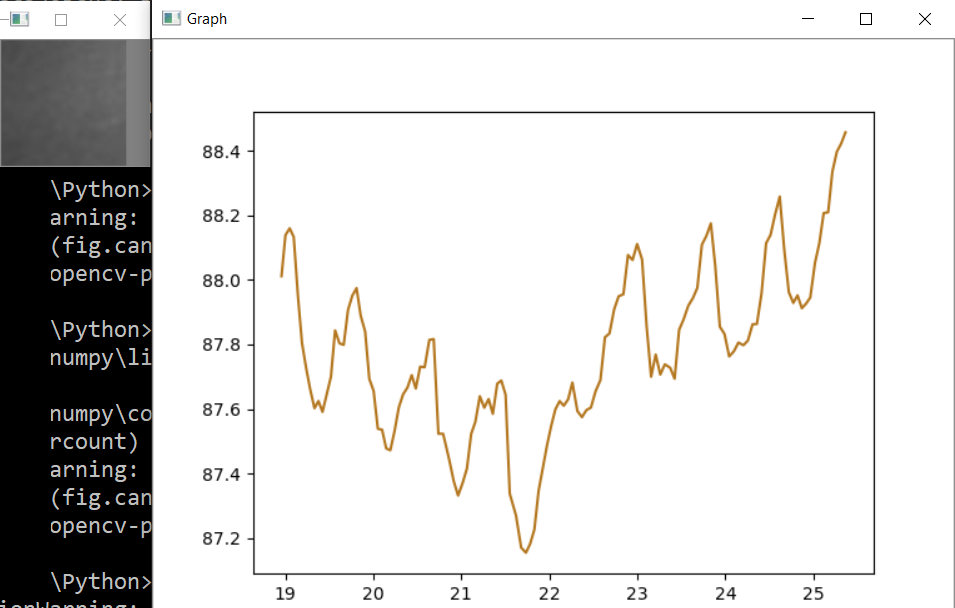

# Remote Heart Rate Detection

A tiny Python proof of concept of detecting the heart rate using webcamera.

Usage: run the app from command line, place the body this way that face skin will be in the crop area, stay still and watch the graph.

